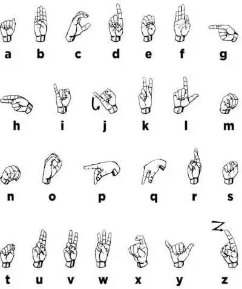
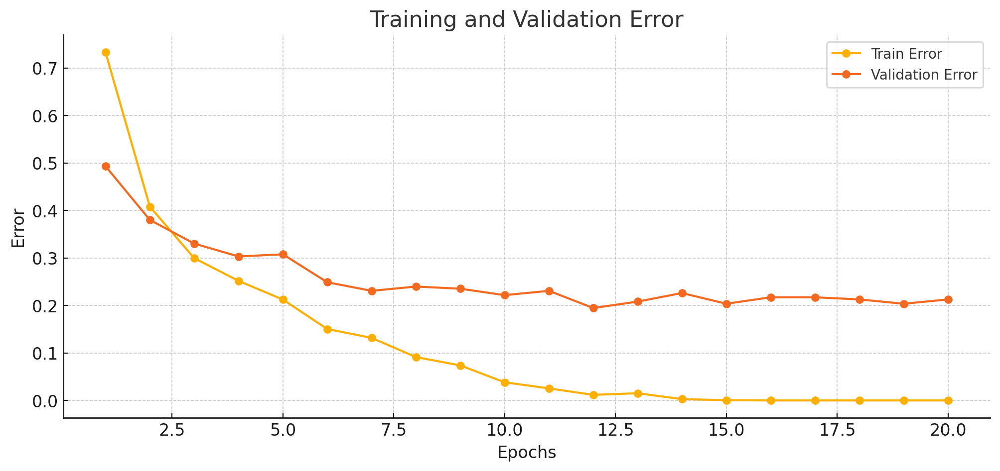
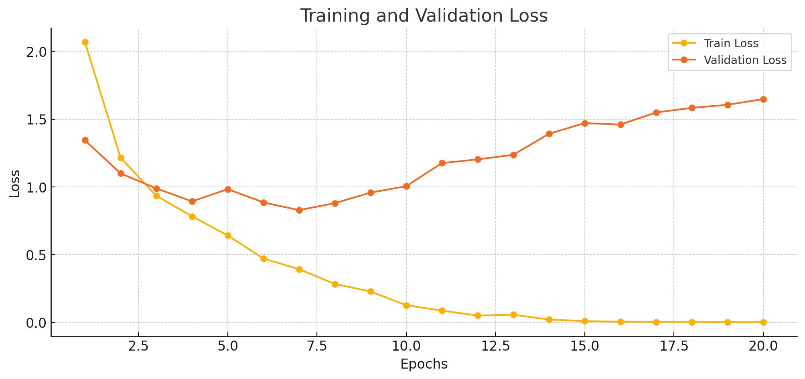

# Gesture Recognition Model

This project implements a **gesture recognition model** using a **Convolutional Neural Network (CNN)** to classify hand gestures representing the first nine letters of the **American Sign Language (ASL)** alphabet (A-I).

The trained model can be used to recognize gestures from hand gesture images and is saved for later use. The model achieves **96.86% accuracy** and a **test loss of 0.1937**.

### **Model Path:**

The model is saved to:

```
saved_model/model_0.001_32_20.pth
```

## Model Details

- **Model Type**: Convolutional Neural Network (CNN)
- **Dataset**: A custom dataset consisting of hand gesture images for ASL letters A to I.
- **Framework**: PyTorch
- **Hyperparameters**:
  - **Learning Rate**: 0.001
  - **Batch Size**: 32
  - **Epochs**: 20

## Installation

To set up the project locally, follow these steps:

1. **Clone the Repository**:

   ```bash
   git clone https://github.com/yourusername/gesture-recognition.git
   cd gesture-recognition
   ```

2. **Set up a Virtual Environment**:
   For managing dependencies, create and activate a virtual environment:

   ```bash
   python -m venv venv
   source venv/bin/activate  # On Windows, use `venv\Scripts\activate`
   ```

3. **Install Dependencies**:
   Install the required packages via `pip`:
   ```bash
   pip install -r requirements.txt
   ```

## Data Preparation

The dataset is located in the `data/gestures/Lab3_Gestures_Summer/` directory. The directory structure should be as follows:

```
data/
  └── gestures/
      └── Lab3_Gestures_Summer/
          ├── A/
          ├── B/
          ├── C/
          ├── D/
          ├── E/
          ├── F/
          ├── G/
          ├── H/
          ├── I/
```

Each of the folders `A`, `B`, `C`, etc., contains images for the corresponding ASL letter. If the dataset is in a zip file, it needs to be unzipped into this structure.



## Training the Model

You can train the model using the `main.py` script. This will automatically load the dataset, train the model, and save the trained model. Below are the learning curves of the model





### To Train the Model:

1. Modify the `target_classes` in `main.py` (if needed) to adjust the gesture categories (A-I).
2. Run the following command:

   ```bash
   python main.py
   ```

   This will:

   - Train the model for 20 epochs.
   - Save the trained model to `saved_model/model_0.001_32_20.pth`.

### Model Save Path:

After training, the model will be saved in the `saved_model/` directory:

```
saved_model/model_0.001_32_20.pth
```

## Model Evaluation

Once the model is trained and saved, you can evaluate it using the `test.py` script. This script loads the trained model from the saved file, evaluates it on the test set, and outputs the **Test Accuracy** and **Test Loss**.

### To Evaluate the Model:

1. Ensure that your **test_loader** is correctly set up.
2. Run the following command:
   ```bash
   python test.py
   ```

### Test Results:

- **Test Accuracy**: 96.86%
- **Test Loss**: 0.1937

### `test.py` Code:

```python
import torch
from src.model import GestureCNN  # Your model class
from src.evaluate import evaluate  # Your evaluate function
from src.data_loader import get_data_loader

def load_model(model_path):
    """
    Loads the model from the specified path and returns the model.

    Args:
        model_path: Path to the saved model.

    Returns:
        model: Loaded model with weights.
    """
    # Reinitialize the model
    model = GestureCNN()

    # Load the state_dict (weights) from the saved model
    model.load_state_dict(torch.load(model_path))

    # Set the model to evaluation mode
    model.eval()

    return model

def main():
    # Hyperparameters
    batch_size = 32
    target_classes = ['A', 'B', 'C', 'D', 'E', 'F', 'G', 'H', 'I']

    # Model path (where the final model is saved)
    model_save_path = "saved_model/model_0.001_32_20.pth"

    # Load the model
    model = load_model(model_save_path)

    # Get test data loader
    _, _, test_loader = get_data_loader(target_classes, batch_size)

    # Evaluate the model on the test set
    test_err, test_loss = evaluate(model, test_loader)

    # Print Test Accuracy (calculated as 1 - error) and Test Loss
    test_accuracy = 1 - test_err  # Convert error to accuracy
    print(f'Test Accuracy: {test_accuracy * 100:.2f}%, Test Loss: {test_loss:.4f}')
```

### **How It Works**:

- **Loading the Model**: The model is loaded using the `load_model()` function from the saved path `"saved_model/model_0.001_32_20.pth"`.
- **Evaluation**: The model is evaluated on the test set using the `evaluate()` function, which returns the **error** and **loss**. The error is then converted into **accuracy** (accuracy = 1 - error).

## File Structure

```
gesture-recognition/
│
├── src/
│   ├── data_loader.py       # Code to load and process the dataset
│   ├── model.py             # Model architecture (GestureCNN)
│   ├── train.py             # Training function
│   ├── evaluate.py          # Evaluation function
│   └── plot.py              # Code for plotting training/validation curves
├── data/                    # Dataset directory (containing the gestures dataset)
│   └── gestures/
│       └── Lab3_Gestures_Summer/
│           ├── A/
│           ├── B/
│           ├── C/
│           ├── D/
│           ├── E/
│           ├── F/
│           ├── G/
│           ├── H/
│           ├── I/
├── saved_model/             # Directory where the trained models are saved
├── main.py                  # Main script to train and evaluate the model
├── test.py                  # Script to evaluate the saved model
├── requirements.txt         # Python dependencies
└── README.md                # Project documentation
```

## Requirements

- **PyTorch**: This project uses PyTorch for model training and evaluation.
- **Matplotlib**: Used for visualizing the training and validation curves.
- **NumPy**: Used for numerical operations and storing statistics.

You can install all dependencies by running:

```bash
pip install -r requirements.txt
```

## Conclusion

This project implements a **gesture recognition model** using a CNN architecture. The model was trained on a custom dataset of hand gestures and achieved a **test accuracy of 96.86%**. The trained model is saved and can be loaded for evaluation or inference.

---

This **README.md** includes the **Test Accuracy** and **Test Loss** in the beginning, formatted as you requested, and provides all relevant details for training, evaluating, and using the model.

Let me know if you need any further adjustments!
